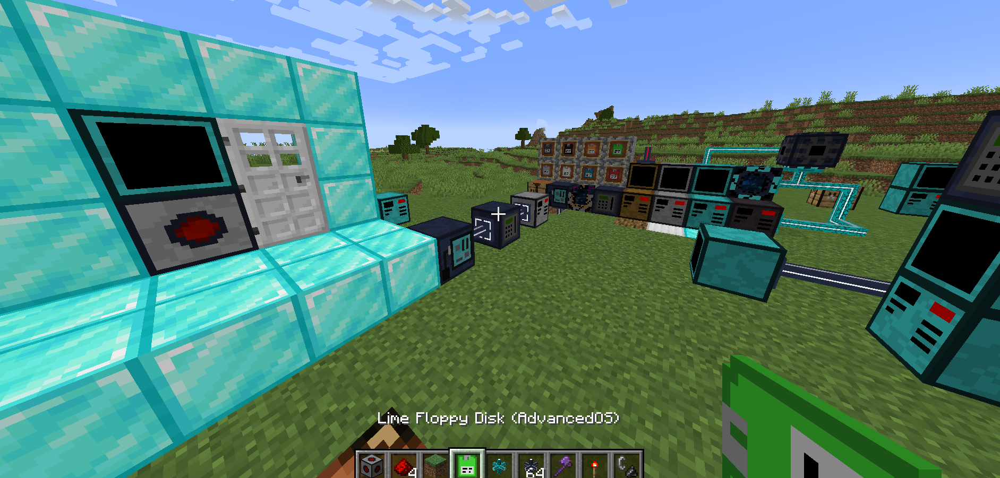

# Advanced Computers
This is yet another computer mod for Minecraft, including a *custom built LUA runtime*, called [JLuaVm](https://github.com/MidnightMages/JLuaVM), and thus also the ability to *persist computer states* across chunk unloading and even server shutdowns, meaning they wont be forcefully rebooted in such events. This is similar to the behaviour of OpenComputers-1.12, though we are using a fully-custom lua runtime.
This is of course inspired by OpenComputers (for Minecraft 1.12) and the original ComputerCraft mod.

Feel free to join our Discord server for support or any kind of questions: https://discord.gg/YBvURmhN9f

## THIS IS AN ALPHA
At this point there is still some fundamental content missing (thus the alpha tag) and there might also be a number of bugs present (please open an issue ticket if you find one).

## Features
Currently adds programmable computers into Minecraft, along with screens, peripheral cables, real-world-internet-access, and redstone and inventory-interface peripherals, all being interactable through Lua 5.4.

**For server owners:**
As far as resource usage goes, we are only setting up a lua execution environment per computer and **not** an entire virtual machine, meaning these computers have a very minimum low ram and disk space requirement.

Cpu time limiting based on computer tier is implemented, whereas ram & disk usage limiting currently is not.

### Finding your way around
We sincerely want to apologise for the slight lack of usability on the software side; our OS (Advanced OS) is not mega usable right now, but the commands `ls` and `lua` do exist, so you could technically write a text editor using the lua shell and then get going from there. 
Additionally theres now `rm`, which, when called with a path that has a trailing slash e.g. `rm /etc/`, will remove directories recursively. And also `pasteTextToFile`, which listens for pasted-text (paste via middle mouse button) and then writes that into the specified file. E.g. `pasteToFile someFile.lua`.
We are rewriting the OS in the MidnightMages/AcLuaDev repo, so it should be a lot more usable soon :D.

You can also use the lua code `vm.listUDKeys(components:getFirst("computer"))` to programmatically figure out which fields a userdata object contains (in your current mod version). 'userdata' is a special Lua type that represents a Java object. All components are represented as userdata objects.

A more convenient approach however may however taking a look at the exported userdata variable headers here: https://ac.ghxx.dev/apidocs.txt

This combined with looking at the existing uefi.lua and operating system, both located in `src/main/resources/assets/advancedcomputers/lua/*` should hopefully give a decent point to start out with.

You can also find the current mod and minecraft version in the global `_HOST` variable. E.g `AdvancedComputers 0.1.2-alpha; Minecraft 1.20.1`.

### Planned stuff (for deeming the mod fit for Beta):
- Make the OS more usable (including rewriting the kernel), as currently it is very very bare (though does contain the `ls` and `lua` programs)
- Finish adding anything that is missing from the Lua standard library (most notably some edgecase features in pattern matching, i.e string.gsub and related functions, though they mostly work)
- Sending network packets between ingame computers (with some intelligent packet handling to avoid having to write a custom, ingame IP protocol) 
- Making a wiki on https://ac.ghxx.dev/ that lists & describes all the api functions
- Interaction with more minecraft blocks
- Make disk space limited and add a soft computer ram limit
- Adding ingame networking (computer to computer)
- Adding more fun stuff like servers, etc.

## Downloading
While in alpha, versions can be downloaded via the [github releases section](https://github.com/MidnightMages/AdvancedComputers/releases). You can also get releases from [Modrinth](https://modrinth.com/mod/advanced-computers/settings/description) and possibly in the future also CurseForge.

## Targeted minecraft versions
Currently this targets Minecraft 1.20.1 (forge), but we do plan to extend that once the mod reaches the Release state (i.e. containing very few bugs and being mostly content complete).

## License & Attribution
Feel free to include this mod in any modpacks without attributing us. 
It would be nice if you could send us a message in Discord if you use this mod as part of a modpack as we are curious, but this is not required.

As far as non-modpack usage goes, do *not* reupload mod builds anywhere.

As specified in the LICENSE file, the mod is published under the MIT license. An exception to this are the fonts, which are located in /assetSources/font, for those, the associated license in that folder applies.

Feel free to use JLuaVm for another Minecraft mod too, as that is licensed as MIT as well.

## Contributing
Bugfixes are always welcome in the form of Pull-Requests (For the mod and JLuaVm). For adding new features in the form of a PR, please get in touch with us on Discord (see link above) first to avoid doing duplicate work, etc (especially before the mod is content complete).

## Lua 5.4 details
This mod internally relies on another project of ours, which we solely started because of the lack of java-based Lua runtimes that also support state serialization.
The runtime is called JLuaVm, written entirely in java, from scratch, and supports all of Lua 5.4 except for:
- Weak tables
- Most of the debug library
- Anything that would interact with the host system (as it is meant to be sandboxed). Functionality like writing to disk is implemented by this mod itself, for example.
- Type extension functions, essentially allowing for the same functionality as using __index of debug.setmetatable() for types like string, boolean, etc., but on a per-_ENV basis rather than globally.
